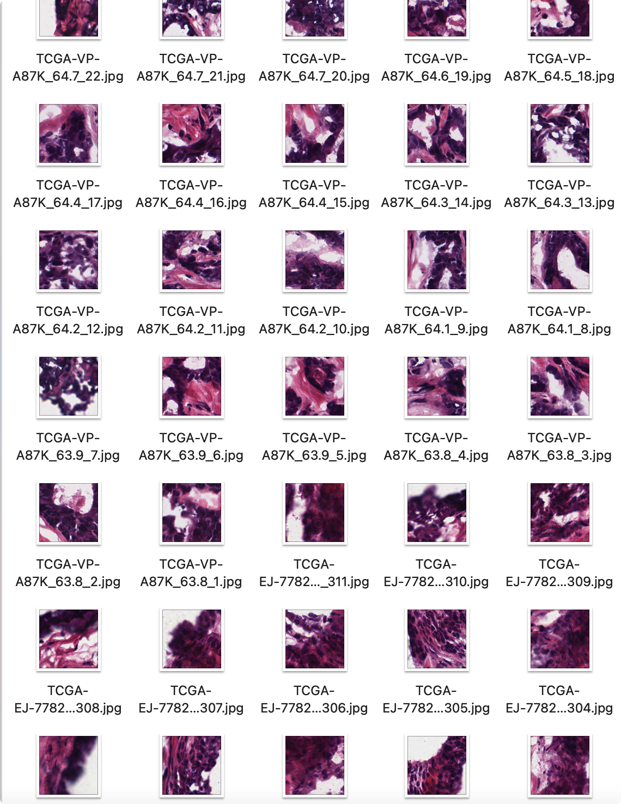
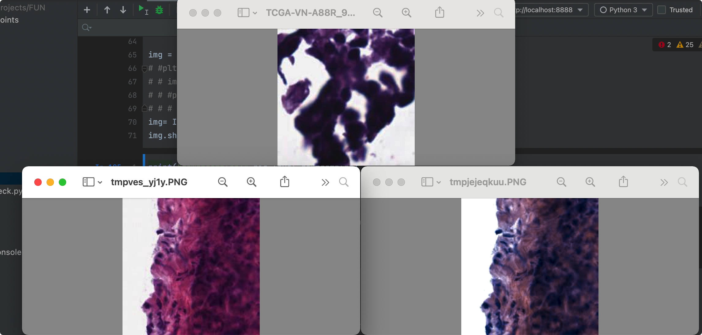

# 基于图像处理的格里森系数分类

## 数据预处理

### 数据下载

本项目所用到的所有数据来源于国外的一个癌症研究所的The Cancer Genome Atlas Program(TCGA)，其中有400余例公开的前列腺癌症患者的组织切片以及病理报告中的格里森系数以供本文的模型训练与测试。其中，组织切片的格式为SVS，是WSI数据，仅一份文件就非常庞大（GB为数量级）；病理报告格式为PDF，我们主要想从其中获得对应病例的格里森系数。

（TCGA官网）

项目伊始，为获得数据，我们直接想到的方法是从其官网直接下载。通过简单的点选操作从而选择前列腺癌症的相关数据，这种方法是可行的，我们可以顺利获得所需要的SVS文件。但又需手动下载病理报告，过程较为繁琐。之后又尝试使用R语言中的TCGAbiolinks程序包，这样可以快速批量下载所需要的数据。详细应用可参考官网：https://www.bioconductor.org/packages/release/bioc/html/TCGAbiolinks.html

至此我们得到了449张诊断切片（Diagnostic slide），723张（Tissue slide）与481张病理报告（Pathology report）。

（诊断切片）

（病理报告）

由此我们获得了最终的数据集，并将其进行标签。

### 数据筛选

由于WSI图像尺寸过大，现通过下采样对图像进行缩略处理。经过筛选之后再映射回原图。

首先，我们将每一张WSI图像切割为多个小尺寸的patch。第一步的数据筛选便是基于其RGB值来进行的。此处我们引入一个蓝比(Blue Rate)公式：
$$
B R_{i}=\frac{100 \times B_{i}}{1+R_{i}+G_{i}} \times \frac{256}{1+R_{i}+G_{i}+B_{i}}
$$
由以上公式可以直观看出，蓝比也即反映了“B值”在图像中的占比。这对我们的数据筛选以及之后的模型训练过程起到了至关重要的作用。同理，我们也可以计算出图像的红比（Red Rate）。由于在本文的图像数据集中，蓝色和红色两个通道占绝大部分，由此我们只考虑这两种颜色的影响。

对于一些的patch，其所包含的信息为噪声信息，需要将其过滤：例如部分有过多的无效染色，或包含了太多的背景信息。针对无效染色，我们设置如果一个patch的蓝比大于100，或是红比大于110，或是包含图像信息大于99%，我们将其过滤；针对背景信息过多，我们设置如果一个patch包含图像信息少于70%，我们将其过滤。经过筛选，我们得到的patch数据集大致如下：

在不同的染色切片中，染色深浅的不同也会影响模型的准确度。为了消除这个因素，我们选择将其进行色彩归一化：

