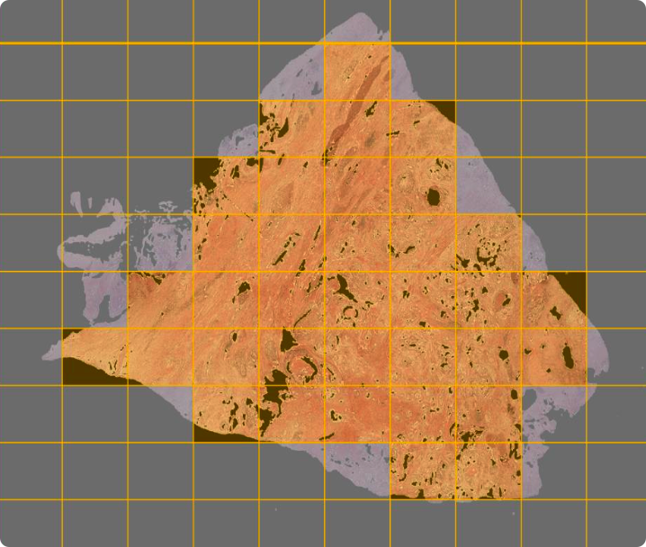
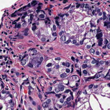

# 基于图像处理的格里森系数分类

## 数据准备

本项目所用到的所有数据来源于国外的一个癌症研究所的The Cancer Genome Atlas Program(TCGA)，其中有400余例公开的前列腺癌症患者的组织切片以及病理报告中的格里森系数以供本文的模型训练与测试。其中，组织切片的格式为SVS，是WSI数据，仅一份文件就非常庞大（GB为数量级）；病理报告格式为PDF，我们主要想从其中获得对应病例的格里森系数。


（TCGA官网）

项目伊始，为获得数据，我们直接想到的方法是从其官网直接下载。通过简单的点选操作从而选择前列腺癌症的相关数据，这种方法是可行的，我们可以顺利获得所需要的SVS文件。但又需手动下载病理报告，过程较为繁琐。之后又尝试使用R语言中的TCGAbiolinks程序包，这样可以快速批量下载所需要的数据。详细应用可参考官网：https://www.bioconductor.org/packages/release/bioc/html/TCGAbiolinks.html

至此我们得到了449张诊断切片，与481张病理报告。


（诊断切片）


（病理报告）

其中有381张诊断切片与病理报告的病例相对应，由此我们获得了最终的数据集，并将其进行标签。


## 图像处理

​	.svs图像是医学专用slide图像，直观感受就是相当之大，细节相当之多。想要读取一张slide图片可能只能使用ASAP这种专用的viewer或者用openslide来切一片来看。

​	主要难点在于数据处理上，首先要肯定的是我们要做端到端的网络，但一整张图片又读不进去，所以要考虑切分成若干batch并把合适的batch扔进去。



​	在此使用双重筛选标准：

1. 图像<240的有效像素点数不得少于整张图片的0.6
2. 取前10最高蓝值*的图像


​	在此对于蓝值(blue_ratio)我们将其定义为$B R_{i}=\frac{100 \times B_{i}}{1+R_{i}+G_{i}} \times \frac{256}{1+R_{i}+G_{i}+B_{i}}$

​	由于肿瘤细胞在染色后其会明显变为蓝色，所以选取蓝值较高的前10张图片可以大致反映肿瘤的类型。也就是说我们可以将这10张图片的lable直接设为该肿瘤的类型。在此对图像的第一层使用224*224的窗口大小进行切片。

​	作为一名acm选手（不是），在此维护一个大小为10的堆来动态进行筛选，这也能有效减少运行期间的内存。

​	在此之后得到的图片效果就很好😁，是病情比较严重的部分，也是我们需要重点分析的部分。



​	但实际中发现图像有较大噪声。


​	像这种蓝色就会蓝值特别高，但

## 问题记录

图片有严重蓝色影响，怀疑是医生标记。要想办法去除这种噪声的干扰。

openslide这个库的api挺难用的. 而且document不提及任何细节问题。在此猜测read_region()函数的起点是在第0层的，而size是在不同level上选取的。


先蓝色筛，再进一步筛红色

```bash
 find . -name "*.svs" | xargs -I file mv file ./tmp
```

Tldr