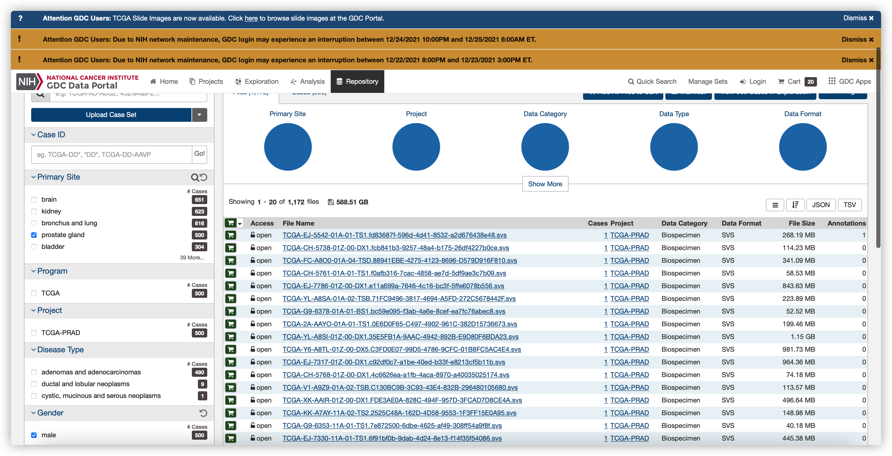
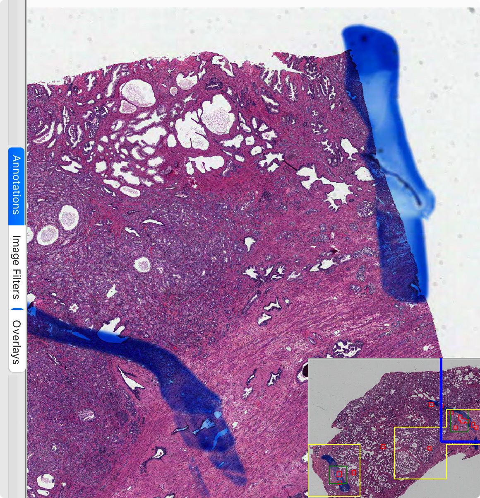
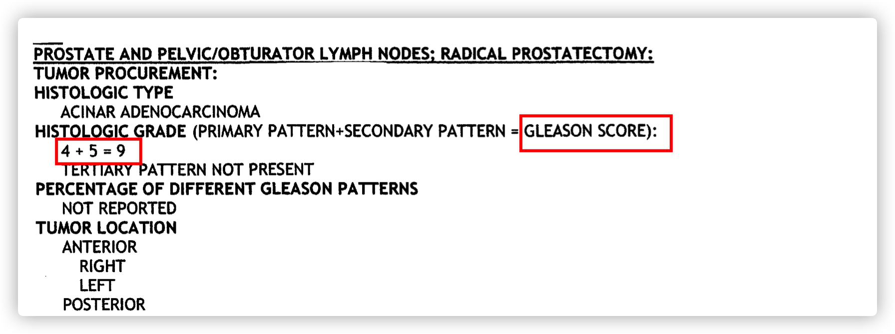

# 基于图像处理的格里森系数分类

## 数据准备

本项目所用到的所有数据来源于国外的一个癌症研究所的The Cancer Genome Atlas Program(TCGA)，其中有400余例公开的前列腺癌症患者的组织切片以及病理报告中的格里森系数以供本文的模型训练与测试。其中，组织切片的格式为SVS，是WSI数据，仅一份文件就非常庞大（GB为数量级）；病理报告格式为PDF，我们主要想从其中获得对应病例的格里森系数。

（TCGA官网）

项目伊始，为获得数据，我们直接想到的方法是从其官网直接下载。通过简单的点选操作从而选择前列腺癌症的相关数据，这种方法是可行的，我们可以顺利获得所需要的SVS文件。但又需手动下载病理报告，过程较为繁琐。之后又尝试使用R语言中的TCGAbiolinks程序包，这样可以快速批量下载所需要的数据。详细应用可参考官网：https://www.bioconductor.org/packages/release/bioc/html/TCGAbiolinks.html

至此我们得到了449张诊断切片，与481张病理报告。

（诊断切片）

（病理报告）

其中有381张诊断切片与病理报告的病例相对应，由此我们获得了最终的数据集，并将其进行标签。